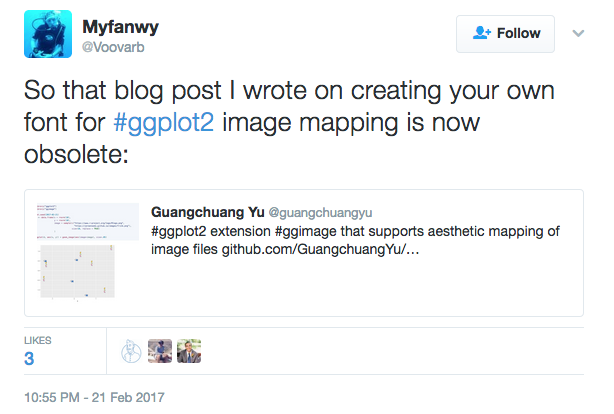
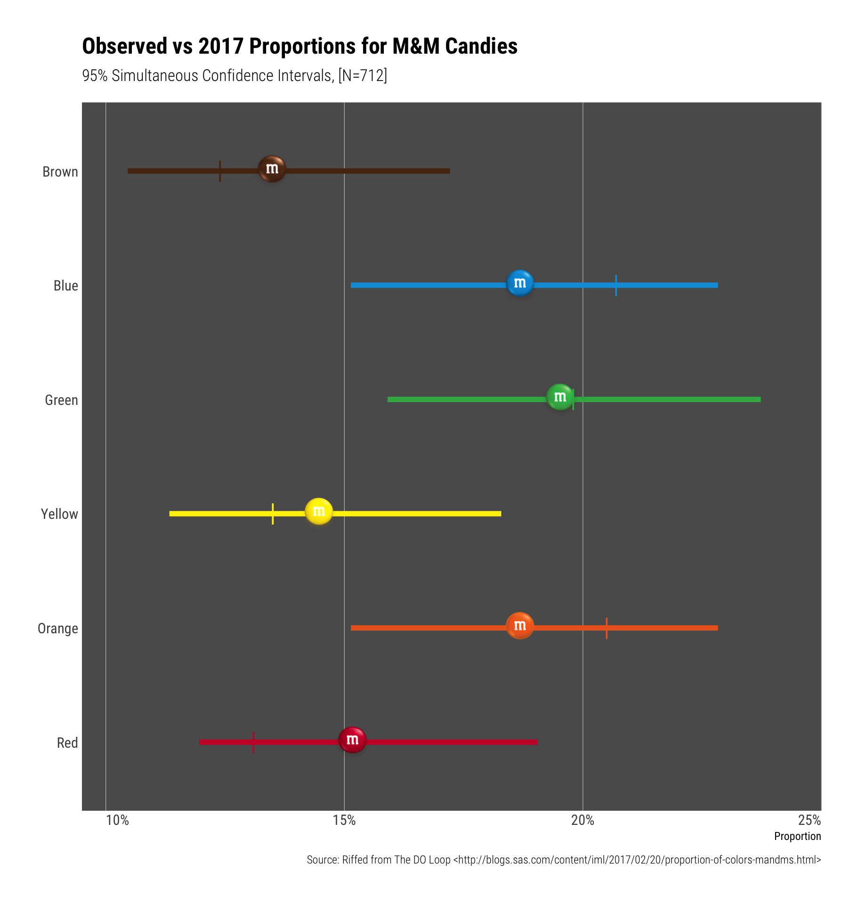
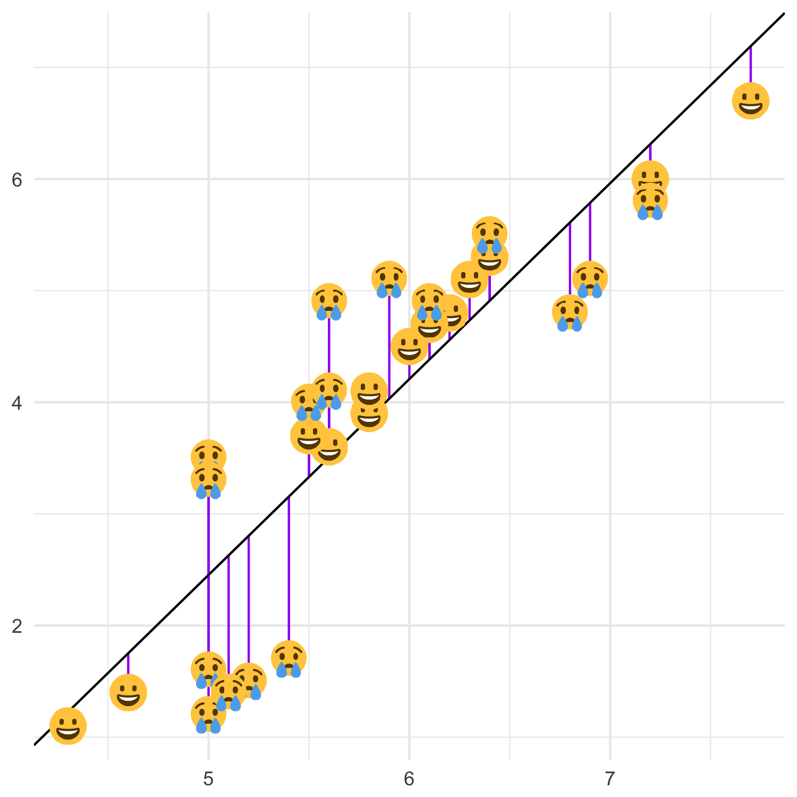
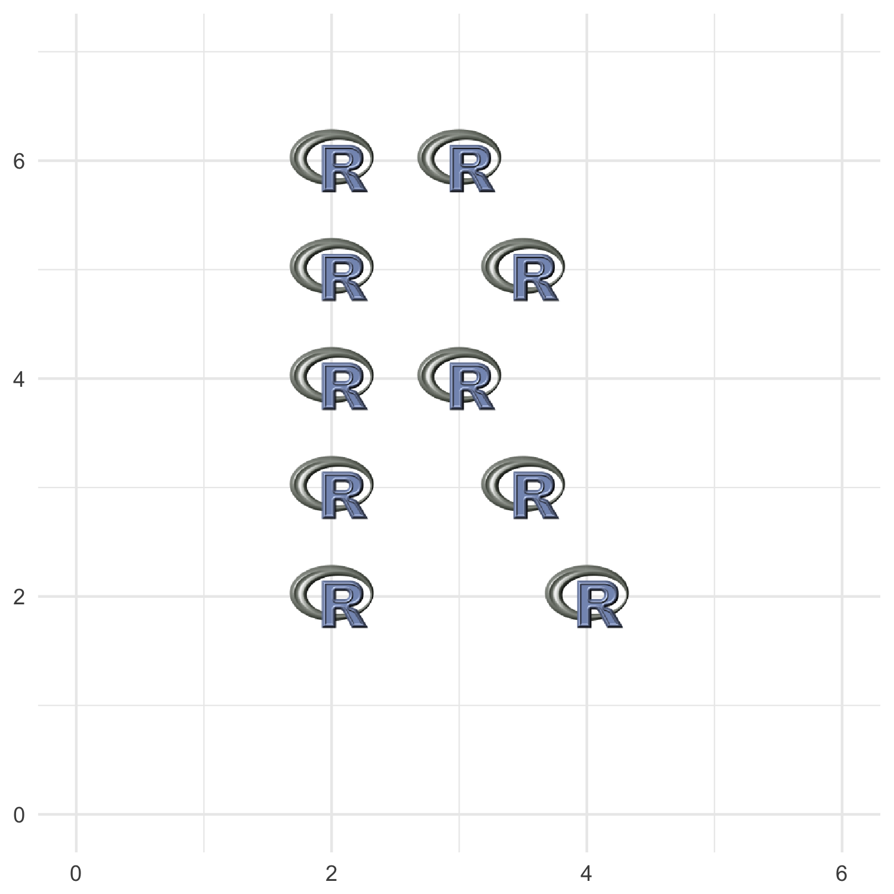
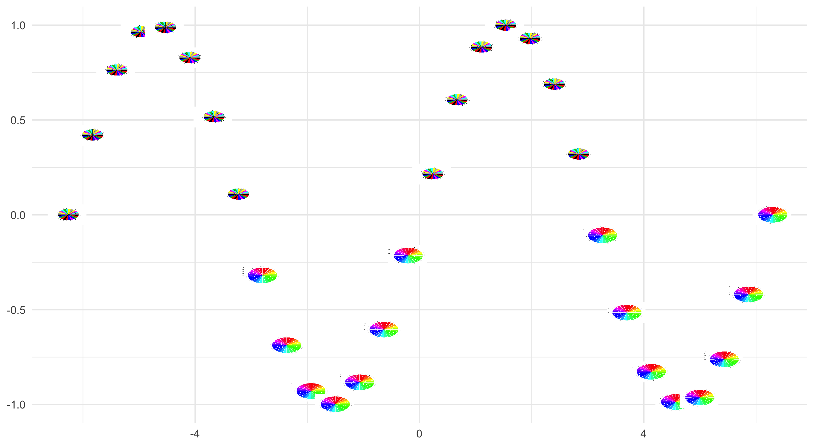
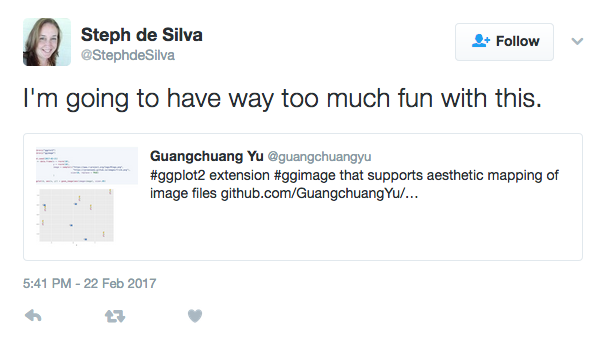

# ggimage：ggplot2中愉快地使用图片

> 作者简介：余光创，香港大学公共卫生学院，生物信息学博士生。
> 
> 个人主页：<https://guangchuangyu.github.io>， 公众号：biobabble


## 图上嵌图片


Base plot可以在做图的时候嵌入图片，使用的是`graphics::rasterImage`：

```r
imgurl <- "http://phylopic.org/assets/images/submissions/295cd9f7-eef2-441e-ba7e-40c772ca7611.256.png"
library(EBImage)
x <- readImage(imgurl)
plot(1, type="n", xlab="", ylab="", xlim=c(0, 8), ylim=c(0, 8))
rasterImage(x, 2, 2, 6, 4)
```


如果我们搜索"ggplot2 image"，会找到类似于下面这样的帖子/博文：

+ [r - Inserting an image to ggplot2 - Stack Overflow](https://stackoverflow.com/questions/9917049/inserting-an-image-to-ggplot2)
+ [Add a background png image to ggplot2 | R-bloggers](https://www.r-bloggers.com/add-a-background-png-image-to-ggplot2/)

也就是说通过程序员秘笈，搜索SO，我们用ggplot2同样也可以做到。

这里我们需要用到`annotation_custom(rasterGrob)`来把图片加到ggplot2图形中，这和base plot是一模一样的。


```r
library(grid)
library(ggplot2)

p <- ggplot(d=data.frame(x=c(0,8), y=c(0,8)), aes(x,y)) + geom_blank()
p + annotation_custom(rasterGrob(x), 2, 6, 2, 4)
```


如果要使用图片来打点画一个散点图，我们就需要`for`循环，对每一个点进行操作，这显然是low level的操作，而`ggplot2`是一个高抽象的画图系统，我们希望能够使用`ggplot2`的语法。

`ggimage`就是来实现这样一个功能，它只是一个简单的包，允许我们在ggplot2中把离散性变量映射到不同的图片来画图。





实现这个功能的想法已经酝酿很久了，在`ggtree`的开发中，我实现了`phylopic`函数来使用Phylopic数据库的图片注释进化树，也实现了`subview`函数在图上嵌入小图。用图片来注释进化树在进化分析上还是很常见的，特别是一些分类学的研究，需要把一些分类学特征在进化树上展示出来，而像我们做病毒，也经常会在一些图片放在进化树上来展示病毒的宿主信息。`ggtree`和可视化有关的函数分两类，一类是加注释的图层，另一类是可视化操作树（比如像旋转、合并分支）。操作树的都是普通函数，而加注释的都是`geom`图层，除了`subview`和`phylopic`，这种所谓逼死处女座的存在，我早就想改成了`geom_subview`和`geom_phylopic`了。这也是为什么我要写`ggimage`的原因了。

## 实例分析

据我所知目前支持使用图片的R包有`CatterPlots`, `rphylopic`, `emoGG`, `ggflags`这几个，都是为特定的目的而实现的。

而`ggimage`是通用的，这里先介绍一个实例：

SAS博客对`M&M`巧克力的[颜色分布做了分析](http://blogs.sas.com/content/iml/2017/02/20/proportion-of-colors-mandms.html)，通过simulation估计不同颜色的置信区间。这个[分析被翻译成R](http://rpubs.com/hrbrmstr/mms)，并产生下图：



其中垂直片段|是真实值，水平片段当然就是置信空间了，而估计值用了`ggimage`来画不同颜色的巧克力。


`ggimage`是通用的包，所以可以被应用于不同的领域/场景中，起码可以让我们画出更好玩的图出来，就像上面`M&M`巧克力颜色分布一样。


前面提到的其它包，都有其特定的应用场景，这里我将用`ggimage`来演示在这些场景中的应用实例。

__`CatterPlots`__这个包只可以应用于base plot中，通过预设的几个猫图（R对象，随包载入）来画散点图。最近[revolutionanalytics有博文](http://blog.revolutionanalytics.com/2017/02/catterplots-plots-with-cats.html)介绍。`ggplot2`没有相应画猫的包。我们可以使用`ggimage`来画，而且不用限制于`CatterPlots`预设的几个图形。


```r
library(ggplot2)
library(ggimage)

mytheme <- theme_minimal() +
    theme(axis.title=element_blank())
theme_set(mytheme)

x <- seq(-2*pi, 2*pi, length.out=30)
d <- data.frame(x=x, y=sin(x))

img <- "http://www.belleamibengals.com/bengal_cat_2.png"
ggplot(d, aes(x, y)) + geom_image(image=img, size=.1)
```


`CatterPlots`实现的方式就是上面谈到的`rasterImage`内部使用了循环。__`rphylopic`__同时支持base plot和`ggplot2`，也是一样的实现方式，不过`rphylopic`内部没有使用循环，一次只能加一个图，它使用的图来自于[phylopic](http://phylopic.org/)数据库。


我们用`ggimage`同样可以使用`phylopic`图片：

```r
img <- "http://phylopic.org/assets/images/submissions/500bd7c6-71c1-4b86-8e54-55f72ad1beca.128.png"
ggplot(d, aes(x, y)) + geom_image(image=img, size=.1)
```


> 图中是`翼足目`动物。


__`emoGG`__是专门来画`emoji`的，如果要画`emoji`的话，我推荐我写的`emojifont`包，在轩哥的`showtext`基础上，把`emoji`当做普通字体一样操作，更方便。

这个包提供了`geom_emoji`图层，虽然一次可以画出散点，但因为不支持`aes`映射，像下面这样的图，就得分成两次，一次画笑脸，一次画哭脸，分别对应于残差是否大于0.5。

```r
set.seed(123)
iris2 <- iris[sample(1:nrow(iris), 30),]
model <- lm(Petal.Length ~ Sepal.Length, data=iris2)
iris2$fitted <- predict(model)

p <- ggplot(iris2, aes(x=Sepal.Length, y=Petal.Length)) + 
  geom_linerange(aes(ymin = fitted, ymax = Petal.Length),
                 colour = "purple") +
  geom_abline(intercept = model$coefficients[1],
              slope = model$coefficients[2])

baseurl <- "https://twemoji.maxcdn.com/72x72/"
emoji <- paste0(baseurl, c("1f600", "1f622"), ".png")

p + geom_image(aes(image=emoji[(abs(Petal.Length-fitted)>0.5)+1]))
```




`aes`映射是`ggplot2`语法的强大之处，让我们可以在更高的抽像水平思考，__`ggflags`__是支持`aes`映射的，只不过它只能用来画国旗而已。这里我也用`ggimage`来展示在图片中加入国旗。


```r
library(rvest)
library(dplyr)

url <- "http://www.nbcolympics.com/medals"

medals <- read_html(url) %>%
    html_nodes("table") %>%
    html_table() %>% .[[1]]
  
library(countrycode)
library(tidyr)

medals <- medals %>%
    mutate(code = countrycode(Country, "country.name", "iso2c")) %>% gather(medal, count, Gold:Bronze) %>% filter(Total >= 10)

head(medals)    
```

|Country       | Total|code |medal | count|
|:-------------|-----:|:----|:-----|-----:|
|Russia        |    33|RU   |Gold  |    13|
|United States |    28|US   |Gold  |     9|
|Norway        |    26|NO   |Gold  |    11|
|Canada        |    25|CA   |Gold  |    10|
|Netherlands   |    24|NL   |Gold  |     8|
|Germany       |    19|DE   |Gold  |     8|


首先我们从网站上爬回来2016年各个国家的奥林匹克奖牌数，画出柱状图，并在`xlab`国家名边上用`ggimage`画上国旗：

```r
baseurl <- "https://behdad.github.io/region-flags/png/"
flags <- paste0(baseurl, medals$code, ".png")
names(flags) <- medals$code

p <- ggplot(medals, aes(Country, count)) + geom_col(aes(fill=medal), width=.8)

p+geom_image(y = -2, aes(image = flags[code])) + coord_flip() + expand_limits(y=-2)  + scale_fill_manual(values = c("Gold" = "gold", "Bronze" = "#cd7f32","Silver" = "#C0C0C0"))
```


## `ggimage`

前面我们介绍了`ggimage`在一些场景的应用实例，虽然有专门的包针对这些应用场景，但`ggimage`在这些领域中的表现要比大多数的包要好。但`ggimage`的使用并不限于这些。这里将展示一些有趣的例子。

#### 用R图标来画R形状

```r
x <- c(2,2,2,2,2,3,3,3.5,3.5,4)
y <- c(2,3,4,5,6,4,6,3,5,2)
d <- data.frame(x=x, y=y)

img <- system.file("img", "Rlogo.png", package="png")
ggplot(d, aes(x, y)) + geom_image(image=img, size=.1) +
  xlim(0,6) + ylim(0,7)
```  



#### 嵌套式绘图

这里通过base plot和ggplot2分别画饼图，还使用之前的正弦函数，把`y>=0`的用base plot画出来的饼图打点，把`y<0`用ggplot2画出来的饼图来打点。这个例子可以应用到很多场景中去，比如一个时间序列的曲线，你要用统计图在某些时间点上展示相关的信息，比如你要在地图上画个某些地方的相关统计信息。

```r
bpie <- tempfile(fileext=".png")
gpie <- tempfile(fileext=".png")
dd <- data.frame(x=LETTERS[1:24], y=1, color=rainbow(24))
ggplot(d, aes(x, y, fill=I(color))) + geom_col() + coord_polar(theta='x') + ggsave(gpie)

png(bpie)
pie(dd$y, col=dd$color)
dev.off()

x <- seq(-2*pi, 2*pi, length.out=30)
d <- data.frame(x=x, y=sin(x))

ggplot(d, aes(x, y)) + geom_image(aes(image=pie[(y>0)+1]))
```




`ggtree`的`subview`函数可以图上嵌图，并不需要保存为图片，但对于`ggplot2`来讲，保存图片也是有好处的，因为`ggplot2`画图，点线是在数据空间上，随着我们保存图片的大小是按比例缩小或放大的，但文字是在像素空间上，和画图空间并不相关。所以当我们嵌图时缩小了画图窗口之后，字体会显得格外大，微调起来也比较繁琐，这时候保存为合适尺寸的图片，再用`ggimage`来加上去，显然就轻松得多。


后续我有时间的话，会写一个`draw_key_image`的函数，实现使用图片来当legend key的功能，也会把`ggtree::subview`和`ggtree::phylopic`这些也搬过来。


祝大家图片玩得开心！



> 感谢大为、太云和雪宁的校稿，特别是大为提出很多修改意见以及给出了用R画R的例子。

 
## References

+ <https://stackoverflow.com/questions/9917049/inserting-an-image-to-ggplot2>
+ <https://www.r-bloggers.com/add-a-background-png-image-to-ggplot2/>
+ <https://github.com/GuangchuangYu/ggimage>
+ <https://github.com/Gibbsdavidl/CatterPlots>
+ <https://github.com/sckott/rphylopic>
+ <https://github.com/baptiste/ggflags>
+ <http://blog.revolutionanalytics.com/2017/02/catterplots-plots-with-cats.html>
+ <http://blogs.sas.com/content/iml/2017/02/20/proportion-of-colors-mandms.html>
+ <http://rpubs.com/hrbrmstr/mms>