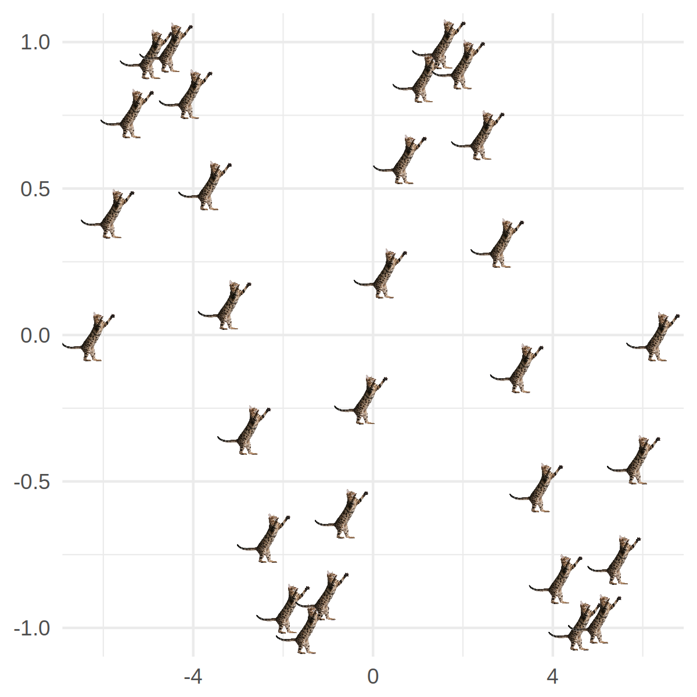

# ggimage：ggplot2中愉快地使用图片

> 作者简介：余光创，香港大学公共卫生学院，生物信息学博士生。个人公众号：biobabble


## 图上嵌图片


Base plot可以在做图的时候嵌入图片，使用的是`graphics::rasterImage`：

```r
imgurl <- "http://phylopic.org/assets/images/submissions/295cd9f7-eef2-441e-ba7e-40c772ca7611.256.png"
library(EBImage)
x <- readImage(imgurl)
plot(1, type="n", xlab="", ylab="", xlim=c(0, 8), ylim=c(0, 8))
rasterImage(x, 2, 2, 6, 4)
```


如果我们搜索"ggplot2 image"，会找到类似于下面这样的帖子/博文：

+ r - Inserting an image to ggplot2 - Stack Overflow
+ Add a background png image to ggplot2 | R-bloggers

也就是说通过程序员秘笈，搜索SO，我们用ggplot2同样也可以做到。

这里我们需要用到`annotation_custom(rasterGrob)`来把图片加到ggplot2图形中，这和base plot是一模一样的。


```r
library(grid)
library(ggplot2)

p <- ggplot(d=data.frame(x=c(0,8), y=c(0,8)), aes(x,y)) + geom_blank()
p + annotation_custom(rasterGrob(x), 2, 6, 2, 4)
```


如果要使用图片来打点画一个散点图，我们就需要`for`循环，对每一个点进行操作，这显然是low level的操作，而`ggplot2`是一个高抽象的画图系统，我们希望能够使用`ggplot2`的语法。

`ggimage`就是来实现这样一个功能，它只是一个简单的包，允许我们在ggplot2中把离散性变量映射到不同的图片来画图。


实现这个功能的想法已经酝酿很久了，在`ggtree`的开发中，我实现了`phylopic`函数来使用Phylopic数据库的图片注释进化树，也实现了`subview`函数在图上嵌入小图。用图片来注释进化树在进化分析上还是很常见的，特别是一些分类学的研究，需要把一些分类学特征在进化树上展示出来，而像我们做病毒，也经常会在一些图片放在进化树上来展示病毒的宿主信息。`ggtree`和可视化有关的函数分两类，一类是加注释的图层，另一类是可视化操作树（比如像旋转、合并分支）。操作树的都是普通函数，而加注释的都是`geom`图层，除了`subview`和`phylopic`，这种所谓逼死处女座的存在，我早就想改成了`geom_subview`和`geom_phylopic`了。这也是为什么我要写`ggimage`的原因了。


----


我相信除了在`ggtree`中，它还可以应用于别的领域/场景中。起码可以让我们画出更好玩的图出来。

据我所知目前支持使用图片的R包有`CatterPlots`, `rphylopic`, `emoGG`, `ggflags`这几个，都是为特定的目的而实现的。而`ggimage`是通用的，所以很容易使用`ggimage`来画出这几个包类似的图。


**`CatterPlots`**


这个包只可以应用于base plot中，通过预设的几个猫图（R对象，随包载入）来画散点图。最近revolutionanalytics有博文介绍。`ggplot2`没有相应的包。使用`ggimage`可以很容易画出猫图，而且不用限制于`CatterPlots`预设的几个图形。


```r
library(ggplot2)
library(ggimage)

mytheme <- theme_minimal() +
    theme(axis.title=element_blank())
theme_set(mytheme)

x <- seq(-2*pi, 2*pi, length.out=30)
d <- data.frame(x=x, y=sin(x))

img <- "http://www.belleamibengals.com/bengal_cat_2.png"
ggplot(d, aes(x, y)) + geom_image(image=img, size=.1)
```



**`rphylopic`**

`rphylopic`同时支持base plot和`ggplot2`，像下面用`ggimage`画的图，用`rphylopic`的话，需要使用`for`循环，一个点一个点地画。


```r
img <- "http://phylopic.org/assets/images/submissions/500bd7c6-71c1-4b86-8e54-55f72ad1beca.128.png"
ggplot(d, aes(x, y)) + geom_image(image=img, size=.1)
```


>图中是`翼足目`动物。


**`emoGG`**

`emoGG`是专门来画`emoji`的，如果要画`emoji`的话，我推荐我写的`emojifont`包，在轩哥的`showtext`基础上，把`emoji`当做普通字体一样操作，更方便。

这个包提供了`geom_emoji`图层，像下面这样的图，它并不需要循环来实现，可以一个图层一次性全部画出来，然而如果我想`y>0`画一种`emoji`，而`y<=0`画另一种`emoji`表情，就得自己切数据，然后分两个图层来加。


```r
emoji <- "https://twemoji.maxcdn.com/72x72/1f63b.png"
ggplot(d, aes(x, y)) + geom_image(image=emoji)
```


**`ggflags`**

`ggflags`则可以使用`aes`映射，所以一个图层中可以同时加入几个不同的国旗。当然`ggimage`也可以，所以同样，可以轻松地画出来。


```r
cn <- "https://behdad.github.io/region-flags/png/CN.png"
fr <- "https://behdad.github.io/region-flags/png/FR.png"
us <- "https://behdad.github.io/region-flags/png/US.png"

set.seed(123)
d$image <- sample(c(cn, fr, us), size=nrow(d), replace=TRUE)
ggplot(d, aes(x, y)) + geom_image(aes(image=image))
```


**`ggimage`**

目前`ggimage`只实现了一个图层`geom_image`，它的实现是通用的，并且可以使用`aes`映射，上面提到的相关的包，要么是预设图片，要么是从某个来源读取图片，都可以使用`ggimage`轻松地实现类似的图形。


后续我有时间的话，会写一个`draw_key_image`的函数，实现使用图片来当legend key的功能，也会把`ggtree::subview`和`ggtree::phylopic`这些也搬过来，再者是输入不单可以是图片，还应该支持`ggplot`对象。


----

**References**

+ <https://stackoverflow.com/questions/9917049/inserting-an-image-to-ggplot2>
+ <https://www.r-bloggers.com/add-a-background-png-image-to-ggplot2/>
+ <https://github.com/GuangchuangYu/ggimage>
+ <https://github.com/Gibbsdavidl/CatterPlots>
+ <https://github.com/sckott/rphylopic>
+ <https://github.com/baptiste/ggflags>
+ <http://blog.revolutionanalytics.com/2017/02/catterplots-plots-with-cats.html>
